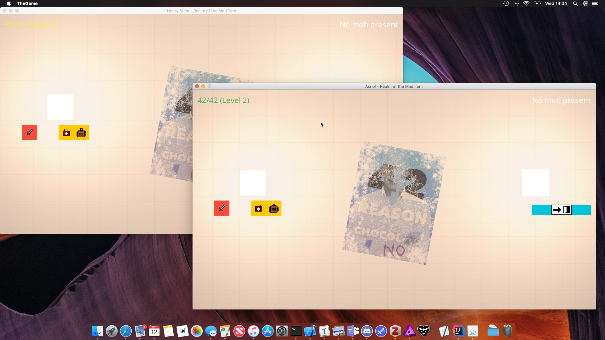

# Realm of the Mad Tom
A Java-based MUD. What more do you want?

_Background by Dennis van Zuijlekom. Edited._

## Project information
For a detailed understanding of the project's objectives and basic gameplay, please consult the [spec writeup](SPEC.md).

## Compiling, running, and deployment
### Running in Eclipse
1. Import the project into Eclipse using the Project Import Wizard.
2. Click the "Run" button to compile and run.

#### Adding to your build path
##### IntelliJ:
1. Right-click on the library JAR file in `libraries` and select 'Open Library Settings...'.
2. In the Export pane, check the box next to the library JAR file.

##### Eclipse:
1. Right-click on the library JAR file in `libraries` and select 'Build Path > Add to Build Path'.

#### Exporting app with libraries
##### IntelliJ
1. Go to 'File > Project Structure > Project Settings > Artifacts'.
2. Click the Plus button, followed by 'JAR > From modules and dependencies'.
3. Follow the prompts.
4. Add the step to your Run/Debug configuration.

##### Eclipse
1. Go to 'File > Export' and select 'Java > Runnable JAR file'.
2. Ensure that the option 'Package required libraries into generated JAR' is selected. Follow all other prompts.